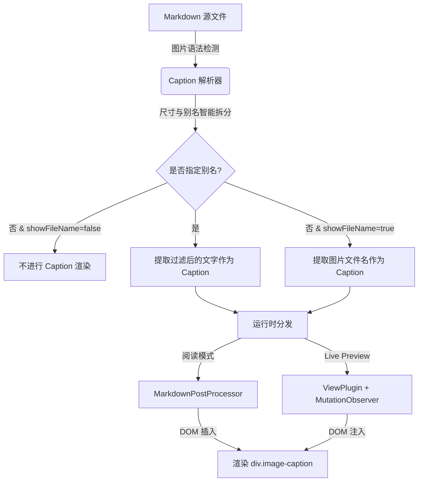

# AI-Agent 协同开发指南与治理规范 (AGENT.md)

欢迎加入 **Obsidian Image Caption Plugin** 的协同开发！为了确保本项目保持极高的工程素养、卓越的性能表现，并百分之百符合 Obsidian 社区严苛的安全性审查，任何 AI 协同 Agent 与人类开发者在阅读或修改本仓库时，必须严格遵守本指南。

---

## 1. 项目全局概述与核心愿景
本项目致力于解决 Obsidian 在 Reading Mode 和 Live Preview 模式下缺乏原生图片说明（Caption）呈现的问题。我们将开发一个零侵入、高兼容、且多窗口自适应的高品质插件，使得用户指定的别名 (Alias) 或 Alt 文本能优雅地展现在图片下方。

---

## 2. 核心运行机制与架构模块

### 2.1 核心数据流拓扑


### 2.2 单一事实来源 (SSOT) 职责索引
项目目录下的所有文件都有其严密的职责划分。在进行任何代码修改或查看时，请首先参阅 **[FILETREE.md](file:///Users/bcs/MacSync/Codex%20Projects/wk%20image%20caption/FILETREE.md)** 导航图，并严禁越界或随意堆积冗余文件。

---

## 3. 避坑与社区合规硬性红线 (MANDATORY)

### 3.1 零 `innerHTML` 安全红线 (极其重要)
Obsidian 社区审核系统对 `innerHTML` 和 `outerHTML` 实行一票否决制。
- **严禁**：使用 `el.innerHTML = ...` 或 `document.createElement('div')`。
- **必须**：使用内置的 `activeDocument.createDiv()`、`createSpan()`、`createEl()`。
- **示例**：
  ```typescript
  // ❌ 错误示范 (将被社区直接封杀)
  const el = document.createElement("div");
  el.innerHTML = `<span class="caption">${text}</span>`;
  
  // ✅ 正确示范
  const captionEl = activeDocument.createDiv({ cls: 'image-caption' });
  captionEl.setText(text);
  ```

### 3.2 多开窗口与 Popout 兼容性
Obsidian 1.0 引入了多窗口（Popout Windows）功能。插件若直接使用全局的 `document` 或 `window` 对象，在拖出新窗口的笔记中会彻底失效并崩溃。

| ❌ 严禁直接使用 | ✅ 必须替换为 | 说明 |
| :--- | :--- | :--- |
| `document.createElement("div")` | `activeDocument.createDiv()` | Popout 窗口拥有自己独立的 document 树 |
| `document.createElement("span")` | `activeDocument.createSpan()` | 同上 |
| `document.body` | `activeDocument.body` | 每个独立窗口的 Body 是不同的 |
| `document.addEventListener(...)` | `activeDocument.addEventListener(...)` | 事件监听必须绑定在对应窗口的 document 上 |
| `window.setTimeout(...)` | `activeWindow.setTimeout(...)` | 定时器必须绑定在活动的物理窗口对象上 |
| `this.registerDomEvent(document, ...)` | `this.registerDomEvent(activeDocument, ...)` | 严禁全局 `document` 挂载，会引发严重的跨视口泄露 |

### 3.3 样式特异性与 `!important` 零滥用
- **严禁**：在 `styles.css` 中滥用 `!important` 强行覆盖样式。这会破坏 Obsidian 主题系统并阻碍用户的自定义 CSS。
- **必须**：通过提高选择器特异性（Specificity），如 `.markdown-preview-view .image-caption` 或 `.markdown-source-view .image-caption` 进行精确权重控制。

### 3.4 TypeScript 与 ESLint 强类型约束
- **严禁使用 `any`**。必须通过定义明确的接口（如 `Settings` 结构）或明确的类型断言实现强类型化。
- 未使用的参数必须加上下划线前缀（如 `_view: EditorView`）。
- 空 catch 块必须加上说明注释（如 `/* position may be invalid during document changes */`）。
- 严禁空头 `eslint-disable-next-line`。如若必要，必须附加明确的规则名称与说明注释（如 `// eslint-disable-next-line @typescript-eslint/no-explicit-any -- Obsidian API returns untyped data`）。

### 3.5 UI 大小写与命名规范
- 所有设置项标题、描述与按钮文字，必须严格遵循 **Sentence case**（首字母大写，其余小写。例如 `"Show image file name as caption"` 而非 `"Show Image File Name As Caption"`）。
- 插件命令（Command）的注册名称中，**严禁**包含插件名前缀，Obsidian 会自动在前方注入插件名。
